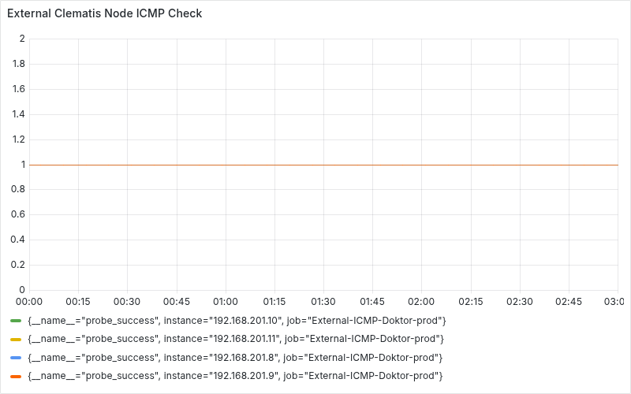

# Monitoring Report Assistant

監視作業のアシスタントツールです．
```
$ git clone https://github.com/cdsl-research/monitoring-report-assistant.git
Cloning into 'monitoring-report-assistant'...
remote: Enumerating objects: 20, done.
remote: Counting objects: 100% (20/20), done.
remote: Compressing objects: 100% (14/14), done.
remote: Total 20 (delta 6), reused 14 (delta 3), pack-reused 0 (from 0)
Receiving objects: 100% (20/20), 42.08 KiB | 8.42 MiB/s, done.
Resolving deltas: 100% (6/6), done.
$
```

## get-grafana-panel-images.sh

監視作業で使用するGrafanaダッシュボードの画像を一括取得するツールです．

このスクリプトでは，[Grafana Image Renderer](https://grafana.com/grafana/plugins/grafana-image-renderer/)を使用します．

Grafana Image Rendererとは，Grafana上にあるダッシュボードの画像をPNG形式でレンダリングする，バックエンドプラグインです．


### 環境構成
- Ubuntu Server : 24.04.2
- K3s : v1.30.6+k3s1
- Grafana : 3.12.9

### 使い方

シェルスクリプトを実行します．
```
$ bash get-grafana-panel-images.sh
```

画像を現在のディレクトリに保存してよいか、確認します．（Y:はい / n:いいえ)
```
Are you sure you want to export to "/home/c0a22100/monitoring-report-assistant"? [Y/n]: Y
```

取得したいダッシュボードの日付を選択します．

今日の場合は「1」、特定の日付の場合は「YYYY-MM-DD」形式で入力してください．

```
Select a date. Enter 1 to select today's date, or specify a date (e.g., 2025-05-17): 1
```
取得したいダッシュボードで表示する時間帯を、日本時間で入力してください．（例: 09:00-12:00）
```
Enter the time range. (JST, start-end, e.g., 09:00-12:00): 09:00-12:00
```

### 実行結果の例
```
$ bash get-grafana-panel-images.sh 
Select a date. Enter 1 to select today's date, or specify a date (e.g., 2025-06-10): 2025-07-14
Enter the time range. (JST, start-end, e.g., 09:00-12:00): 09:00-12:00
Image saved to /home/cdsl/monitoring-report-assistant/grafana-panel-images/20250714-102428-External-Clematis-Node-Check-1.png
Image saved to /home/cdsl/monitoring-report-assistant/grafana-panel-images/20250714-102430-External-Clematis-Node-Check-2.png
Image saved to /home/cdsl/monitoring-report-assistant/grafana-panel-images/20250714-102432-External-Clematis-Node-Check-4.png
Image saved to /home/cdsl/monitoring-report-assistant/grafana-panel-images/20250714-102434-External-Clematis-Node-Check-5.png
Image saved to /home/cdsl/monitoring-report-assistant/grafana-panel-images/20250714-102436-External-Clematis-Node-Check-6.png
Image saved to /home/cdsl/monitoring-report-assistant/grafana-panel-images/20250714-102438-External-Clematis-Node-Check-7.png
Image saved to /home/cdsl/monitoring-report-assistant/grafana-panel-images/20250714-102440-External-Clematis-Node-Check-8.png
Image saved to /home/cdsl/monitoring-report-assistant/grafana-panel-images/20250714-102442-External-OpenVPN-Check-1.png
Image saved to /home/cdsl/monitoring-report-assistant/grafana-panel-images/20250714-102444-External-ESXi-Check-1.png
Image saved to /home/cdsl/monitoring-report-assistant/grafana-panel-images/20250714-102446-External-ESXi-Check-2.png
Image saved to /home/cdsl/monitoring-report-assistant/grafana-panel-images/20250714-102448-External-ESXi-Check-3.png
Image saved to /home/cdsl/monitoring-report-assistant/grafana-panel-images/20250714-102450-External-ESXi-Check-4.png
Image saved to /home/cdsl/monitoring-report-assistant/grafana-panel-images/20250714-102453-Internal-ESXi-Check-1.png
Image saved to /home/cdsl/monitoring-report-assistant/grafana-panel-images/20250714-102455-Internal-ESXi-Check-2.png
Image saved to /home/cdsl/monitoring-report-assistant/grafana-panel-images/20250714-102457-Internal-ESXi-Check-3.png
Image saved to /home/cdsl/monitoring-report-assistant/grafana-panel-images/20250714-102459-Internal-ESXi-Check-4.png
Image saved to /home/cdsl/monitoring-report-assistant/grafana-panel-images/20250714-102501-Internal-NAS-Check-1.png
```

### 取得した画像の例
上記の実行結果の例で取得した画像(`/home/c0a22100/monitoring-report-assistant/grafana-20250518-000000-External-Clematis-Node-Check-1.png`)です．



#### タイムゾーン
Grafana Image Rendererの仕様上、横軸がUTCで表示されます．

表示された時間に9時間を足して、日本時間に読み替えてください．

#### 出力される画像のサイズ変更

ソースコード内の`IMAGE_HEIGHT`と`IMAGE_WIDTH`の値を編集することで、出力される画像のサイズを変更できます．
